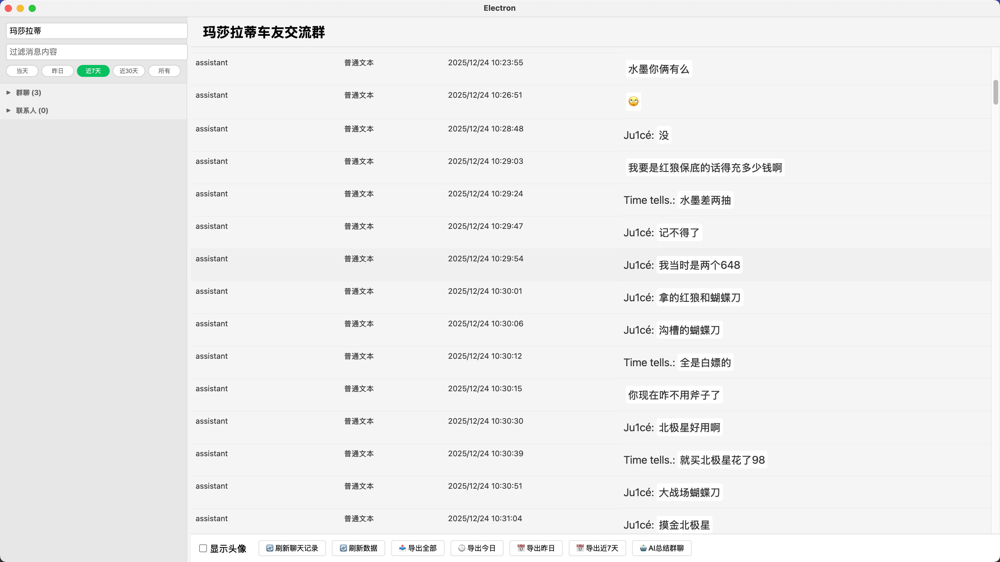
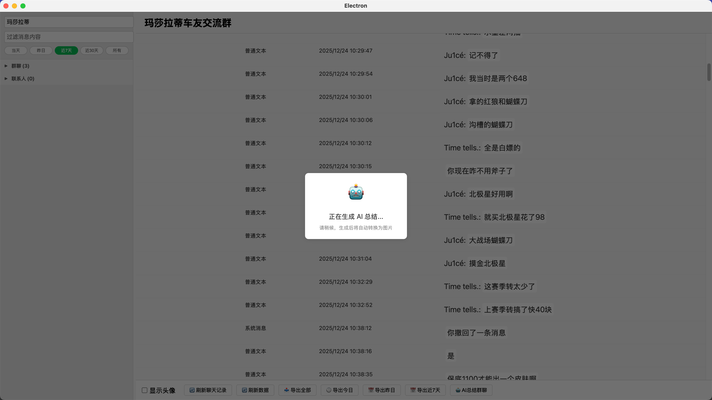
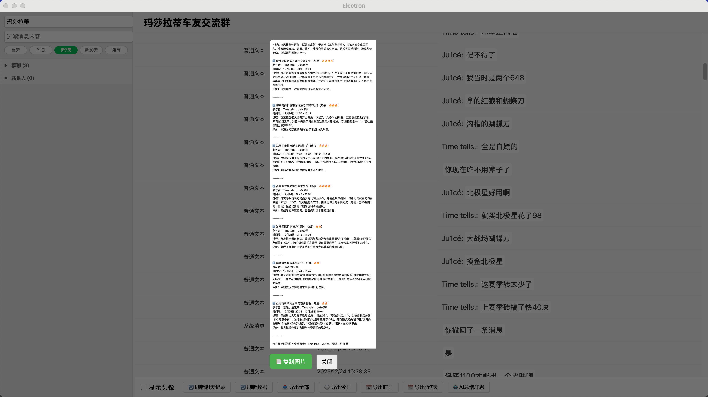

# WechatExplorer

MAC系统 获取微信聊天记录 AI一键生成群聊总结
是一个基于 Electron + React + TypeScript 开发的微信聊天记录查看与分析工具。它支持查看解密后的微信数据库内容，提供聊天记录搜索、导出以及 AI 智能总结功能。

## 📸 预览

  
  
  

## [点击这里下载](https://github.com/Wxw-Gu/WechatExplorer/releases/tag/v1.0.0)

## 📦 安装说明

1. 下载下方的 `xxx.dmg` 文件。
2. 打开 DMG 并将应用拖动到 **Applications** (应用程序) 文件夹。
3. 如果遇到“无法打开，因为开发者无法验证”的提示，请前往：
   `系统设置 -> 隐私与安全性 -> 仍要打开`。

## ✨ 功能特性

- **聊天记录查看**: 浏览微信好友和群聊的聊天记录。
- **全局搜索**: 快速搜索聊天内容。
- **AI 智能总结**: 集成 DeepSeek AI，一键总结群聊精华内容，生成话题报告。
- **图片生成**: 将 AI 总结的内容生成精美图片，方便分享。
- **数据导出**: 支持导出聊天记录为 CSV 文件（今日、昨日、近7天或全部）。
- **安全隐私**: 所有数据仅在本地处理，AI 功能需自行配置 API Key。

## 🚀 快速开始

### 使用前置要求

- 微信>=4.0 无法使用
- 微信<=4.0 需要获取自己微信本地数据库的密码， 获取方式参考： [Mac 导出微信聊天记录](https://blog.vcvit.me/2024/08/02/mac-export-wechat-chat-records/)
- 如果无法获取本地数据库密码 则无法使用当前项目
- Node.js（已验证 Node 24 可运行；推荐 v16+）
- 包管理器：pnpm@7 或 npm（本仓库已验证 npm 可跑通）
- 解密后的微信数据库文件 (`.db`) 和对应的密钥
- [DeepSeek API Key](https://www.deepseek.com/) (用于 AI 总结功能)

### 本地开发运行（已跑通）

1. 安装依赖（首次会下载 Electron 并编译 SQLite 相关依赖）

   ```bash
   npm install
   ```

2. 启动开发模式（Electron + 渲染进程 dev server）

   ```bash
   npm run dev
   ```

3. 看到 Electron 窗口弹出即启动成功；渲染进程 dev server 默认在：

   - http://localhost:5173/

停止运行：在终端按 `Ctrl + C`。

### 配置（可选）

可在 UI 中填写，也可以通过 `.env` 配置。示例见 `.env.example`：

```bash
cp .env.example .env
```

常用字段：

- `VITE_DB_KEY`：微信数据库密钥（可选）
- `VITE_DEEPSEEK_API_KEY`：DeepSeek API Key（可选）
- `VITE_FILTER_MSG_TYPES`：过滤消息类型（可选）

### 常见安装问题

- `npm install` 卡在下载 Electron / 报 `ETIMEDOUT`：
  - 本仓库已在 `.npmrc` 增加 Electron 镜像配置（`electron_mirror` / `electron_builder_binaries_mirror`），直接重试 `npm install` 通常即可。
  - 也可以切换 npm registry 后重试：

    ```bash
    npm config set registry https://registry.npmmirror.com
    npm install
    ```

### 构建与打包

```bash
npm run build
```

- macOS 打包：

  ```bash
  npm run build:mac
  ```

- Windows 打包：

  ```bash
  npm run build:win
  ```

- Linux 打包：

  ```bash
  npm run build:linux
  ```

## ⚠️ 免责声明

本项目仅供学习和研究使用。请勿用于非法用途。开发者不对使用本项目造成的任何后果负责。请遵守相关法律法规和微信使用协议。

## 🔗 参考

- [WechatMessageExplorer](https://github.com/svcvit/WechatMessageExplorer)
